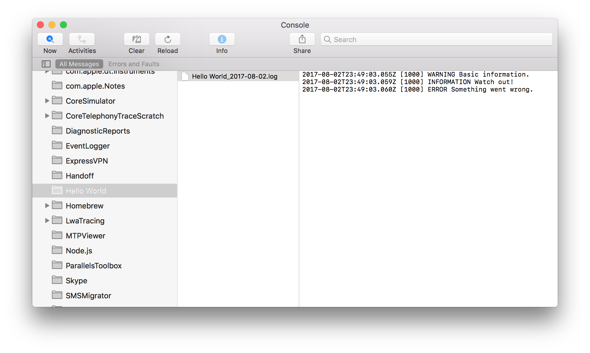
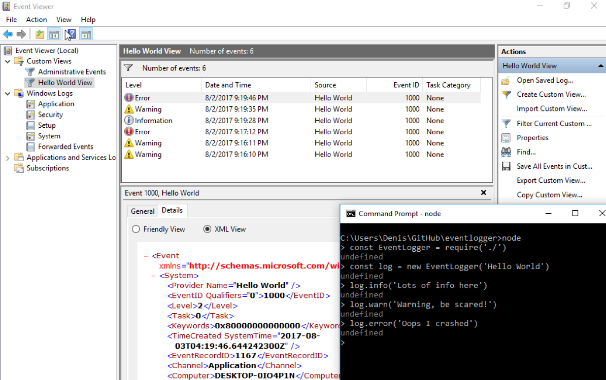
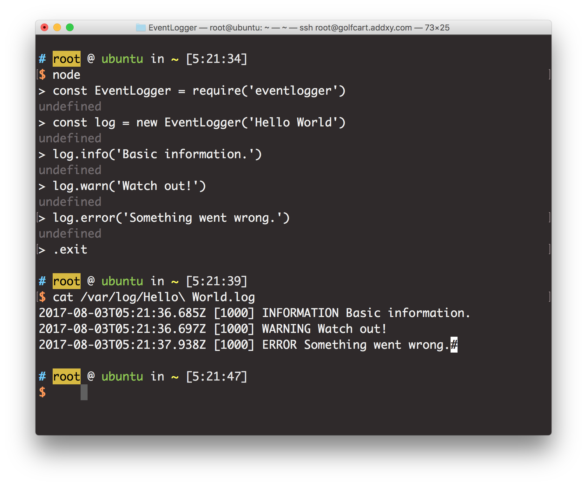

# EventLogger

[](https://travis-ci.org/DenisCarriere/eventlogger)
[](https://ci.appveyor.com/project/DenisCarriere/eventlogger)
[](https://badge.fury.io/js/eventlogger)
[](https://coveralls.io/github/DenisCarriere/eventlogger?branch=master)
[](https://raw.githubusercontent.com/DenisCarriere/eventlogger/master/LICENSE)
[](http://kangax.github.io/compat-table/es5/)

[](https://github.com/feross/standard)

Cross platform Event Logger for NodeJS written in pure ES5 Javascript with zero dependencies.

> The Windows Event Logging portion is heavily inspired from [`node-windows`](https://github.com/coreybutler/node-windows).

## Install

```bash
$ npm install eventlogger
```

## How to use

```js
const EventLogger = require('eventlogger')
const log = new EventLogger('Hello World')

log.info('Basic information.')
log.warn('Watch out!')
log.error('Something went wrong.')
```

## Operating Systems

-   [x] **Windows** => [`Windows Event Viewer`](https://en.wikipedia.org/wiki/Event_Viewer)
-   [x] **MacOSX** => [`Console`](https://developer.apple.com/documentation/os/logging) => `/Library/Logs/<SOURCE>/<SOURCE>.log`
-   [x] **Linux** => `/var/log/<SOURCE>.log`

## Event Types

-   [x] `info` / `information`
-   [x] `warn` / `warning`
-   [x] `error`
-   [x] `auditSuccess`
-   [x] `auditFailure`

## MacOSX

MacOSX uses the `Console` to capture application information/warning/errors.



## Windows

Windows uses the `EventViewer` to capture application information/warning/errors.



## Linux

Linux stores logs via text files to capture application information/warning/errors.



## API

<!-- Generated by documentation.js. Update this documentation by updating the source code. -->

### EventLogger

EventLogger Constructor

**Parameters**

-   `config` **([Object](https://developer.mozilla.org/en-US/docs/Web/JavaScript/Reference/Global_Objects/Object) \| [string](https://developer.mozilla.org/en-US/docs/Web/JavaScript/Reference/Global_Objects/String))** Configuration (optional, default `{}`)
    -   `config.source` **[string](https://developer.mozilla.org/en-US/docs/Web/JavaScript/Reference/Global_Objects/String)** Source (optional, default `'NodeJS'`)
    -   `config.eventLog` **[string](https://developer.mozilla.org/en-US/docs/Web/JavaScript/Reference/Global_Objects/String)** Event Log (optional, default `'APPLICATION'`)
    -   `config.logPath` **[string](https://developer.mozilla.org/en-US/docs/Web/JavaScript/Reference/Global_Objects/String)** Log Path (optional, default `'~/Library/Logs/NodeJS'`)

**Examples**

```javascript
const EventLogger = require('eventlogger')
const log = new EventLogger({
  source: 'Hello World',
  logPath: '~/Library/Logs'
})
```

#### warn

Warning

**Parameters**

-   `message` **[string](https://developer.mozilla.org/en-US/docs/Web/JavaScript/Reference/Global_Objects/String)** Message
-   `code` **[number](https://developer.mozilla.org/en-US/docs/Web/JavaScript/Reference/Global_Objects/Number)** Code (optional, default `1000`)
-   `callback` **[Function](https://developer.mozilla.org/en-US/docs/Web/JavaScript/Reference/Statements/function)?** Callback

**Examples**

```javascript
const log = new EventLogger()
log.warn('Watch out!')
```

#### info

Information

**Parameters**

-   `message` **[string](https://developer.mozilla.org/en-US/docs/Web/JavaScript/Reference/Global_Objects/String)** Message
-   `code` **[number](https://developer.mozilla.org/en-US/docs/Web/JavaScript/Reference/Global_Objects/Number)** Code (optional, default `1000`)
-   `callback` **[Function](https://developer.mozilla.org/en-US/docs/Web/JavaScript/Reference/Statements/function)?** Callback

**Examples**

```javascript
const log = new EventLogger()
log.info('Basic Information')
```

#### error

Error

**Parameters**

-   `message` **[string](https://developer.mozilla.org/en-US/docs/Web/JavaScript/Reference/Global_Objects/String)** Message
-   `code` **[number](https://developer.mozilla.org/en-US/docs/Web/JavaScript/Reference/Global_Objects/Number)** Code (optional, default `1000`)
-   `callback` **[Function](https://developer.mozilla.org/en-US/docs/Web/JavaScript/Reference/Statements/function)?** Callback

**Examples**

```javascript
const log = new EventLogger()
log.error('Something went wrong!')
```

#### success

Audit Failure

**Parameters**

-   `message` **[string](https://developer.mozilla.org/en-US/docs/Web/JavaScript/Reference/Global_Objects/String)** Message
-   `code` **[number](https://developer.mozilla.org/en-US/docs/Web/JavaScript/Reference/Global_Objects/Number)** Code (optional, default `1000`)
-   `callback` **[Function](https://developer.mozilla.org/en-US/docs/Web/JavaScript/Reference/Statements/function)?** Callback

**Examples**

```javascript
const log = new EventLogger()
log.success('Tests pass!')
```
